# 项目结构与运行逻辑说明

本文解释当前 `eval_l476+SX1280` 项目的代码结构、启动流程和 LWB/Gloria/SX1280 的运行逻辑。它面向中期答辩、后续 PCB bring-up 和自己回看代码时使用。

---

## 1. 项目一句话概括

本项目是在 `STM32L476RG + SX1280` 平台上运行 **LWB (Low-power Wireless Bus)** 协议栈。

当前仓库对应迁移路线中的第 3 阶段:

```text
L433 + SX1262 原始 comboard
        ↓
L433 + SX1262 NUCLEO 开发板适配
        ↓
L476 + SX1262 MCU 迁移
        ↓
L476 + SX1280 radio 迁移  ← 当前仓库
        ↓
自制 L476 + SX1280 comboard PCB
```

当前已验证:

| 调制索引 | 调制方式 | 状态 |
|---|---|---|
| `7` | LoRa SF5 | 双板 HOST + NODE 通过 |
| `8` | GFSK 125 kbit/s | 双板 HOST + NODE 通过 |
| `11` | FLRC 260 kbit/s CR=1/2 | 双板 HOST + NODE 通过 |

当前默认配置在 [Inc/app_config.h](Inc/app_config.h):

```c
#define GLORIA_INTERFACE_MODULATION   11
#define GLORIA_INTERFACE_RF_BAND      24
#define GLORIA_INTERFACE_POWER        10
#define LWB_SCHED_PERIOD              15
#define LWB_N_TX                      2
#define LWB_NUM_HOPS                  6
```

含义:

- 默认使用 `mod 11`,也就是 `FLRC 260 kbit/s`
- 默认频点 `radio_bands[24] = 2450 MHz`
- 每 15 秒一个 LWB round
- 每个 Gloria flood 中每个节点最多转发 2 次
- 调度时按最多 6 跳预留 flood 时间

---

## 2. 顶层目录结构

```text
.
├── Inc/                         # 全局配置和 STM32 头文件
├── Src/                         # main、FreeRTOS 任务、HAL init、interrupt handlers
├── Lib/                         # Flora/LWB/radio/system/time/utils 主体代码
├── Drivers/                     # STM32 HAL / CMSIS
├── Middlewares/                 # FreeRTOS 等中间件
├── Scripts/                     # 辅助脚本
├── .plan/                       # 迁移计划和模块设计文档
├── .ai/                         # porting report / changelog / 工作记录
├── .Hardware differences/       # L433/L476/SX1262/SX1280 差异说明
├── build/                       # 编译输出
├── Makefile                     # 构建入口
├── STM32L476RGTx_FLASH.ld       # 当前 linker script
├── startup_stm32l476xx.s        # 当前 startup file
├── README.md                    # 项目硬件和状态总览
├── MID_TERM_DEFENSE.md          # 中期答辩材料
└── PCB_DESIGN_GUIDE.md          # 自制 PCB 设计指南
```

### 2.1 项目文件结构图

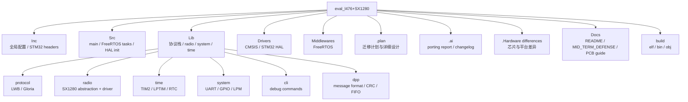

---

## 3. `Src/` 目录: MCU 启动与任务入口

| 文件 | 作用 |
|---|---|
| [Src/main.c](Src/main.c) | MCU 启动主入口,初始化 HAL、时钟、GPIO、SPI、UART、TIM2、LPTIM、RTC,启动 FreeRTOS |
| [Src/freertos.c](Src/freertos.c) | 创建 RTOS 队列和任务,实现 tickless idle 的 pre/post sleep hook |
| [Src/task_com.c](Src/task_com.c) | 最高优先级通信任务,配置 Gloria/LWB 并调用 `lwb_start()` |
| [Src/task_pre.c](Src/task_pre.c) | round 前生成待发送数据包,放入 TX queue |
| [Src/task_post.c](Src/task_post.c) | round 后处理 RX queue、打印统计、触发低功耗状态 |
| [Src/stm32l4xx_it.c](Src/stm32l4xx_it.c) | 中断入口,包括 TIM2、EXTI、UART 等 |
| [Src/stm32l4xx_hal_msp.c](Src/stm32l4xx_hal_msp.c) | HAL 外设底层 MSP 初始化,包括 TIM2_CH4 输入捕获引脚 |
| [Src/system_stm32l4xx.c](Src/system_stm32l4xx.c) | STM32 system clock 基础文件 |

启动主线:

```text
main()
  ├─ HAL_Init()
  ├─ SystemClock_Config()
  ├─ MX_GPIO_Init()
  ├─ MX_SPI1_Init()
  ├─ MX_USART2_UART_Init()
  ├─ MX_TIM2_Init()
  ├─ MX_LPTIM1_Init()
  ├─ system_init()
  ├─ HAL_TIM_Base_Start_IT(&htim2)
  ├─ lpm_init()
  ├─ rtos_init()
  └─ osKernelStart()
```

其中:

- `SYSCLK = 48 MHz`
- `TIM2 = 8 MHz`,1 tick = 125 ns
- `TIM2_CH4` 用于捕获 SX1280 DIO1 边沿
- `LPTIM1 / LSE` 用于低功耗时间基准

### 3.1 硬件连接结构图

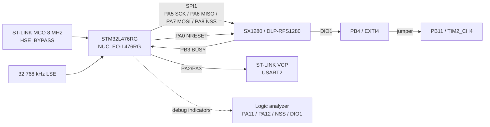

### 3.2 MCU 外设结构图

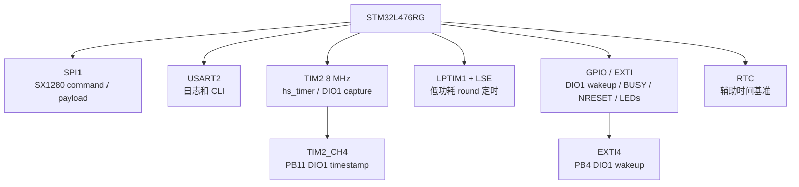

---

## 4. `Lib/` 目录: 项目主体库

```text
Lib/
├── protocol/
│   ├── lwb/                     # LWB 调度、round、slot、schedule
│   ├── gloria/                  # Glossy/Gloria 同步泛洪
│   ├── discosync/               # 其它同步协议代码,当前不是主线
│   └── elwb/                    # 其它 LWB 变体,当前不是主线
├── radio/
│   ├── radio.c                  # 项目 radio 抽象层
│   ├── radio_helpers.c          # payload、TOA、sync word、CAD 等辅助函数
│   ├── radio_constants.c        # 2.4 GHz 频段表、LoRa/GFSK/FLRC 调制表
│   └── semtech/                 # SX1280 driver
├── time/
│   ├── hs_timer.c               # TIM2 高精度定时/输入捕获
│   ├── lptimer.c                # LPTIM 低功耗时间
│   └── rtc.c                    # RTC
├── system/
│   ├── system.c                 # system_init 等系统初始化
│   ├── lpm.c                    # 低功耗状态机
│   ├── uart.c                   # UART 日志输出
│   └── gpio_exti.c              # GPIO 外部中断分发
├── dpp/                         # DPP message 格式、CRC、FIFO/list 工具
├── cli/                         # 串口 CLI 和 radio/gloria 测试命令
├── utils/                       # log、LED、dcstat、misc
├── flocklab/                    # FlockLab 平台相关 pin / indicator
├── bolt/                        # Bolt 相关代码
└── flora_lib.h                  # 统一 include 入口
```

项目最核心的三层是:

```text
LWB scheduler / round logic
        ↓
Gloria synchronous flood
        ↓
radio abstraction + SX1280 driver
```

### 4.1 软件分层流程图

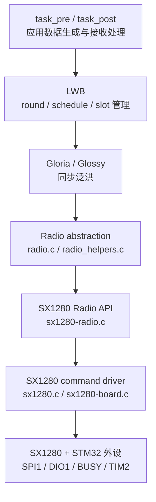

### 4.2 协议栈结构图

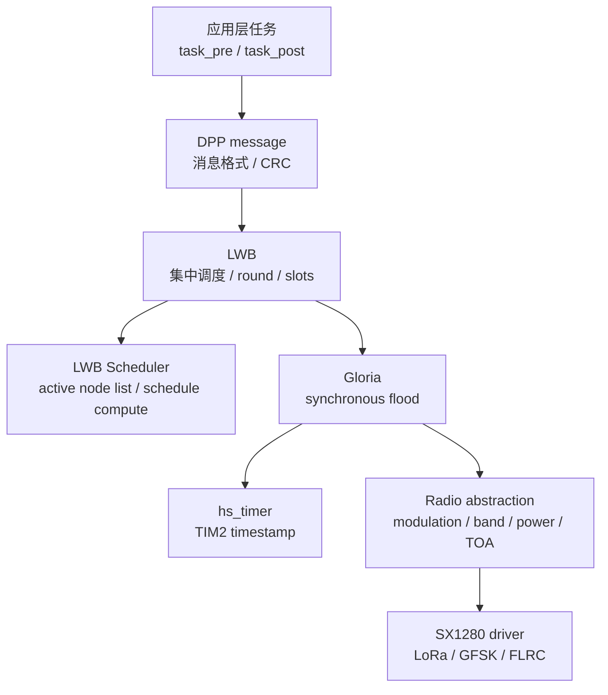

### 4.3 Radio 模块结构图

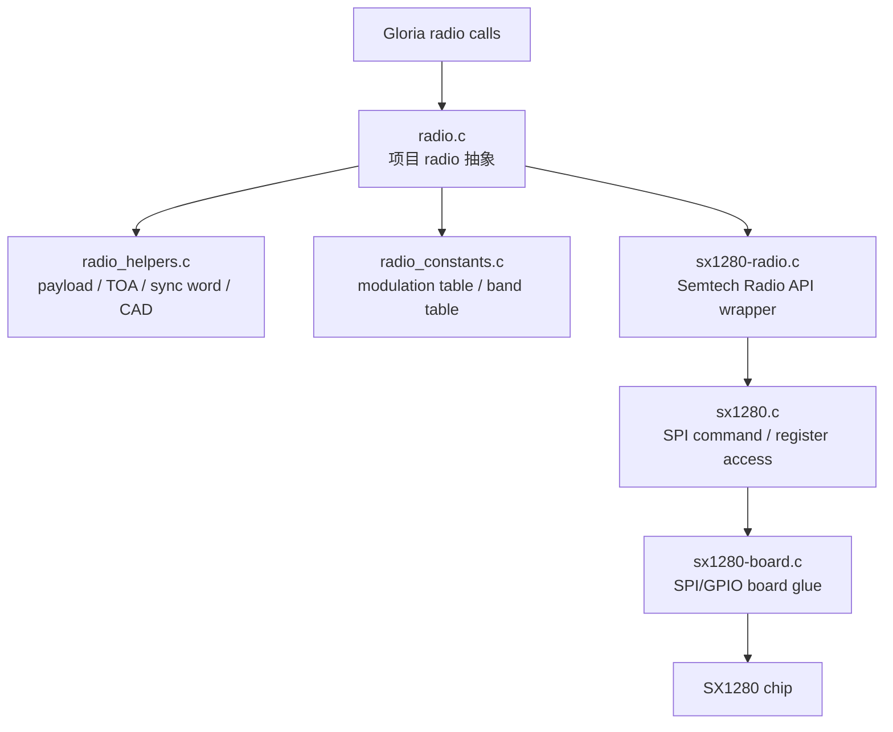

---

## 5. FreeRTOS 任务和队列

`rtos_init()` 创建 3 个主要队列:

| 队列 | 作用 |
|---|---|
| `xQueueHandle_tx` | 待通过 LWB 发出的 DPP message |
| `xQueueHandle_rx` | 从 LWB 网络收到的 DPP message |
| `xQueueHandle_retx` | 数据 ACK 功能打开时用于重传的队列 |

创建的主要任务:

| 任务 | 优先级 | 文件 | 作用 |
|---|---|---|---|
| `lwbTask` / `vTask_com` | 最高 | [Src/task_com.c](Src/task_com.c) | 配置 radio/Gloria/LWB,运行 `lwb_start()` |
| `preTask` / `vTask_pre` | 低 | [Src/task_pre.c](Src/task_pre.c) | 每轮前生成数据包,放入 TX queue |
| `postTask` / `vTask_post` | 低 | [Src/task_post.c](Src/task_post.c) | 每轮后消费 RX queue、打印统计、进入低功耗 |
| `sysTask` | idle 级 | [Src/freertos.c](Src/freertos.c) | CLI 打开时维护系统更新 |

运行关系:

```text
vTask_com 是主控任务
  ├─ 每个 round 前通知 preTask
  ├─ round 中运行 LWB/Gloria/radio
  └─ round 后通知 postTask
```

`preTask` 和 `postTask` 平时阻塞在 `xTaskNotifyWait()` 上,只有 LWB 主循环通知它们时才运行。

### 5.1 FreeRTOS 任务关系图

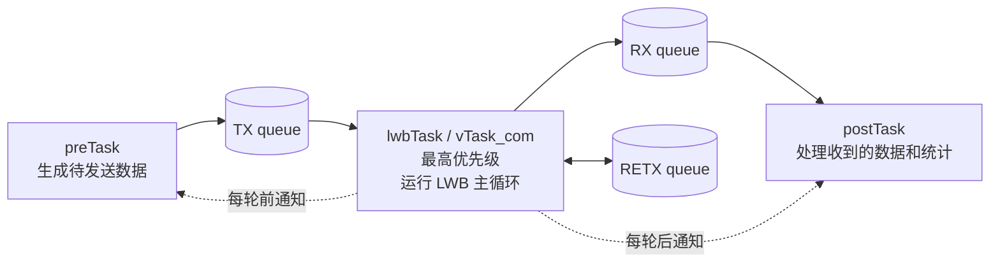

---

## 6. 通信任务 `vTask_com`

`vTask_com()` 是协议栈真正启动的地方。

流程:

```text
vTask_com()
  ├─ radio_wakeup()
  ├─ gloria_set_tx_power()
  ├─ gloria_set_modulation()
  ├─ gloria_set_band()
  ├─ 打印当前 modulation
  ├─ lwb_sched_set_period()
  ├─ lwb_set_n_tx()
  ├─ lwb_set_num_hops()
  ├─ lwb_init(...)
  ├─ 等待 MCU 启动满 1 秒
  └─ lwb_start()      # blocking,正常情况下不返回
```

启动日志里会看到类似:

```text
INFO task_com: modulation index 11: FLRC 260 kbit/s
INFO task_com: LWB successfully set period to 15s
INFO task_com: LWB successfully set n_tx to 2
INFO task_com: LWB successfully set num_hops to 6
INFO lwb: host node, network ID 0x4444
```

如果 `NODE_ID == HOST_ID`,当前固件作为 host。

如果编译时把 `NODE_ID` 改成非 host,当前固件作为 source node。

### 6.1 从上电到 LWB 运行的启动流程图

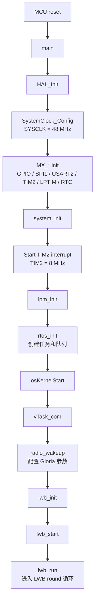

---

## 7. LWB 初始化逻辑

入口:

```c
lwb_init(lwb_task, pre_task, post_task,
         rx_queue, tx_queue, retx_queue,
         listen_timeout, IS_HOST)
```

关键动作:

1. 保存任务句柄和队列句柄
2. 根据 `LWB_N_TX`, `LWB_NUM_HOPS`, payload size 计算各 slot 时长
3. 清空 RX/TX/RETX 队列
4. 判断当前节点是不是 host

Host 初始化:

```text
is_host = true
sync_state = SYNCED
lwb_sched_init(&schedule)
```

Source 初始化:

```text
is_host = false
sync_state = BOOTSTRAP
等待 host schedule
```

### 7.1 Host / Source 初始化分支图

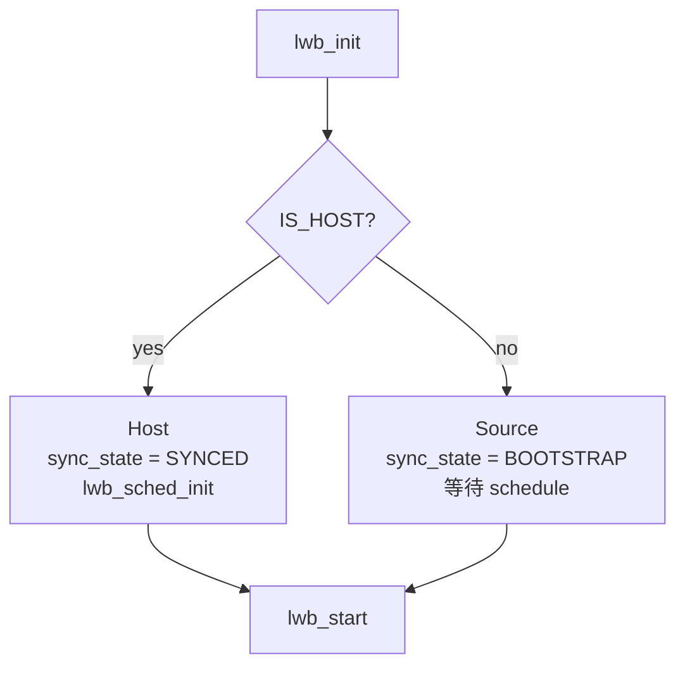

---

## 8. LWB 主循环

入口:

```c
lwb_start()
  └─ lwb_run()
```

`lwb_run()` 是一个不返回的主循环:

```text
while (lwb_running) {
  1. PREPROCESS
  2. SCHED1: host 发 schedule / source 收 schedule
  3. DATA slots: 每个 slot 一个 initiator,其他节点接收/转发
  4. CONTENTION: 新节点或 IPI 更新请求
  5. HOST 计算下一轮 schedule
  6. SCHED2: 发送第二个 schedule / 确认
  7. 打印统计,通知 postTask
  8. 计算下一轮唤醒时间,进入等待/低功耗
}
```

### 8.1 LWB Round 流程图

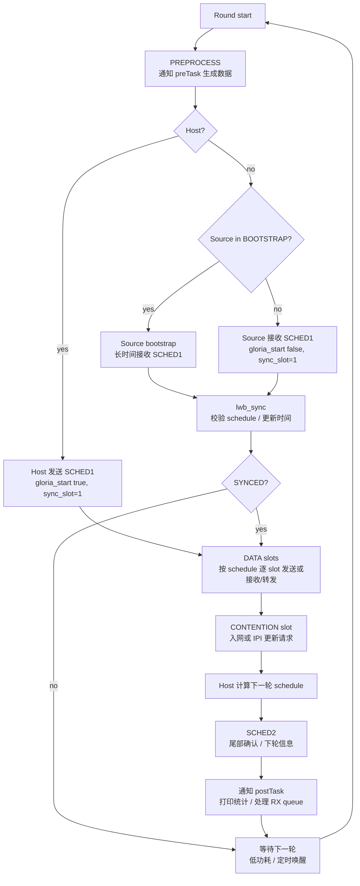

### 8.2 Source bootstrap

Source 节点启动后不是立即发数据,而是进入 bootstrap:

```text
source node
  └─ lwb_bootstrap()
       ├─ gloria_start(false, schedule buffer, ..., sync_slot=1)
       ├─ 长时间 RX 等待 host schedule
       └─ 收到有效 schedule 后进入 SYNCED
```

如果一直收不到 schedule,会 timeout,然后继续等待。

### 8.3 Schedule slot

Host:

```text
lwb_send_schedule()
  └─ gloria_start(true, &schedule, schedule_len, n_tx, sync_slot=1)
```

Source:

```text
lwb_receive_schedule()
  └─ gloria_start(false, &schedule, max_len, n_tx, sync_slot=1)
```

`sync_slot=1` 表示这个 flood 用于更新时间参考。

### 8.4 Data slots

每个 data slot 都看 schedule:

```text
if schedule.slot[slot_idx] == 当前节点 ID:
    当前节点是 initiator,从 tx_queue 取 packet 并发送
else:
    当前节点接收/转发该 slot 的 packet
```

发送路径:

```text
lwb_send_packet()
  ├─ 从 tx_queue 取 DPP message
  ├─ 加 LWB header
  ├─ gloria_start(true, packet, packet_len, n_tx, sync_slot=0)
  └─ gloria_stop()
```

接收路径:

```text
lwb_receive_packet()
  ├─ gloria_start(false, packet buffer, max_len, n_tx, sync_slot=0)
  ├─ gloria_stop()
  ├─ 检查 LWB header
  └─ 放入 rx_queue
```

### 8.5 Contention slot

用于新节点注册或 IPI 更新请求。

Source 如果需要申请:

```text
lwb_contention()
  └─ gloria_start(true, contention packet, ..., sync_slot=0)
```

其他节点/host:

```text
lwb_contention()
  └─ gloria_start(false, contention buffer, ..., sync_slot=0)
```

Host 收到后调用 scheduler 处理请求。

### 8.6 Schedule 2

`SCHED2` 用于 round 尾部确认和下轮信息同步。

Host:

```text
lwb_send_rcv_sched2()
  └─ gloria_start(true, sched2 packet, ..., sync_slot=0)
```

Source:

```text
lwb_send_rcv_sched2()
  └─ gloria_start(false, sched2 buffer, ..., sync_slot=0)
```

---

## 9. Gloria / Glossy 层运行逻辑

LWB 不直接操作 SX1280,而是通过 Gloria。

入口:

```c
gloria_start(is_initiator, payload, payload_len, n_tx_max, sync_slot)
```

Gloria 做的事:

1. 初始化 `gloria_flood_t`
2. 设置 modulation、band、power、payload、header
3. 如果是 initiator,复制 payload 并设置 flood marker
4. 如果是 receiver,清空接收 buffer
5. 调用 `gloria_run_flood()`

`gloria_run_flood()` 后进入 slot 状态机:

```text
gloria_process_slot()
  ├─ 如果 flood 还没结束:
  │    ├─ 如果当前节点该发: gloria_tx()
  │    ├─ 如果还没收到包: gloria_rx()
  │    └─ 否则进入下一个 slot
  └─ 如果 flood 结束:
       └─ flood_callback()
```

收到 packet 后:

```text
gloria_rx_callback()
  └─ gloria_process_rx()
       ├─ 复制 header 和 payload
       ├─ msg_received = true
       ├─ gloria_reconstruct_flood_marker()
       ├─ 需要时同步 timer
       └─ 更新 last_active_slot
```

### 9.1 Gloria Flood 状态流程图

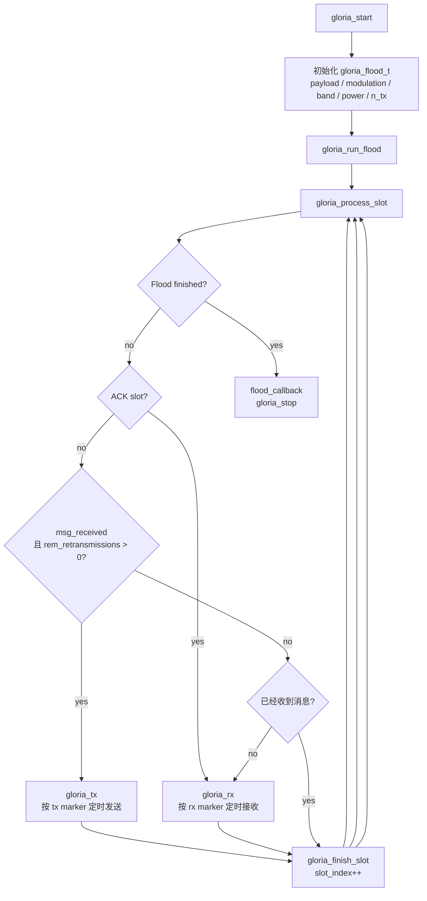

---

## 10. Gloria 时间同步逻辑

Gloria 的关键是知道“这个 flood 从什么时候开始”。

相关文件:

- [Lib/protocol/gloria/gloria_time.c](Lib/protocol/gloria/gloria_time.c)
- [Lib/protocol/gloria/gloria_constants.c](Lib/protocol/gloria/gloria_constants.c)
- [Lib/protocol/gloria/gloria_constants.h](Lib/protocol/gloria/gloria_constants.h)

核心概念:

| 名称 | 作用 |
|---|---|
| `marker` | initiator 设定的 flood 起点 |
| `received_marker` | 从收到的同步 timestamp 得到的网络参考时间 |
| `reconstructed_marker` | receiver 根据 DIO1 捕获时间反推出来的 flood 起点 |
| `rxOffset` | RX 捕获时间与 flood 时间之间的偏移 |
| `txSync` | TX 同步点校准值 |
| `slotOverhead` | 每个 slot 除空中时间外的处理/切换开销 |

Receiver 收到包后:

```text
radio_get_last_sync_timestamp()
  ↓
减去 txSync
  ↓
减去前面 slot 的累计时间
  ↓
减去 floodInitOverhead
  ↓
得到 reconstructed_marker
```

如果该 flood 携带 timestamp,Gloria/LWB 就能更新网络时间。

---

## 11. Radio 抽象层和 SX1280 driver

Radio 分两层:

```text
Lib/radio/radio.c / radio_helpers.c / radio_constants.c
        ↓
Lib/radio/semtech/sx1280-radio.c
        ↓
Lib/radio/semtech/sx1280.c + sx1280-board.c
        ↓
SPI1 + GPIO + SX1280
```

### 11.1 `radio_constants.c`

定义当前平台的 radio 参数:

- 40 个 2.4 GHz 频点: `2402..2480 MHz`
- `RADIO_DEFAULT_BAND = 24`,即 `2450 MHz`
- `RADIO_NUM_MODULATIONS = 14`
- 调制表:
  - `0..7`: LoRa SF12..SF5
  - `8..10`: GFSK
  - `11..13`: FLRC

### 11.2 `radio.c`

负责项目级 radio 抽象:

- `radio_init()`
- `radio_set_config()`
- `radio_transmit_scheduled()`
- `radio_receive_scheduled()`
- DIO1 interrupt/capture callback
- RX/TX duty cycle 统计

初始化时:

```text
radio_init()
  ├─ radio_restore_config(true)
  ├─ hs_timer_capture(&radio_irq_capture_cb)
  ├─ radio_set_irq_direct(true)
  └─ 打印 "initialized"
```

### 11.3 SX1280 driver

`Lib/radio/semtech/` 下是 SX1280 相关驱动:

| 文件 | 作用 |
|---|---|
| `sx1280.c/h` | SX1280 SPI command / register level driver |
| `sx1280-board.c/h` | 板级 SPI/GPIO glue |
| `sx1280-radio.c/h` | Semtech Radio API 风格封装,处理 LoRa/GFSK/FLRC 参数 |

---

## 12. DIO1 中断与时间戳路径

SX1280 的 `DIO1` 是协议时序的核心信号。

当前硬件连接:

```text
SX1280 DIO1
   ├─ PB4  / EXTI4       # 唤醒和 GPIO 中断路径
   └─ PB11 / TIM2_CH4    # 高精度输入捕获路径
```

开发板阶段通过 `PB4 -> PB11` 飞线实现同一个 DIO1 信号进入两个 MCU 引脚。

### 12.1 TIM2_CH4 输入捕获路径

```text
DIO1 rising edge
  ↓
TIM2_CH4 captures CCR4
  ↓
HAL_TIM_IC_CaptureCallback()
  ↓
hs_timer capture callback
  ↓
radio_irq_capture_cb()
  ↓
SX1280 IRQ process / Gloria callback
```

`radio_rx_sync_cb()` 会保存:

```c
radio_last_sync_timestamp = hs_timer_get_capture_timestamp();
```

Gloria 后续用这个时间戳重建 flood marker。

### 12.2 EXTI4 fallback 路径

PB4 也配置为 EXTI4。

如果 EXTI4 先触发:

```text
GPIO_Radio_Callback()
  └─ hs_timer_trigger_capture_from_exti()
```

这会用软件快照模拟一次 capture。精度不如 TIM2 硬件输入捕获,但能保证 IRQ callback 仍然执行。

答辩时建议强调:

> PCB 上必须把 DIO1 同时连到 PB4 和 PB11,因为 LWB/Gloria 既需要低功耗唤醒,也需要高精度时间戳。

### 12.3 DIO1 / IRQ / 时间戳流程图

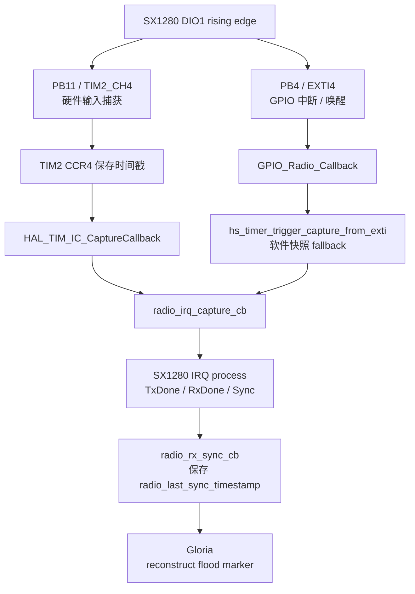

---

## 13. 低功耗运行逻辑

低功耗由 FreeRTOS tickless idle 和 `Lib/system/lpm.c` 管理。

相关配置:

```c
#define LOW_POWER_MODE   LP_MODE_STOP2
```

运行逻辑:

```text
round 活动期间:
  lwbTask 运行 LWB/Gloria/radio

round 结束:
  postTask 处理 RX queue / 打印统计
  lpm_update_opmode(OP_MODE_EVT_DONE)

系统空闲:
  FreeRTOS tickless idle
  PreSleepProcessing()
    └─ lpm_prepare()

下一轮唤醒:
  PostSleepProcessing()
    └─ lpm_resume()
```

唤醒来源包括:

- LPTIM 定时唤醒下一轮 round
- DIO1 / EXTI4 radio event 唤醒

### 13.1 低功耗状态流程图

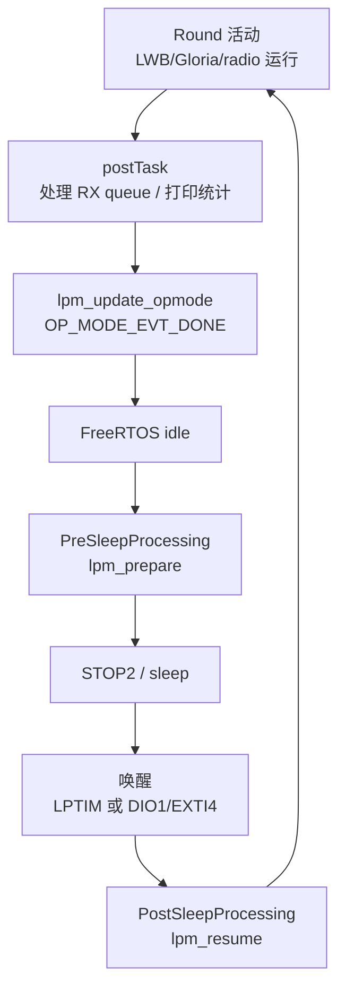

---

## 14. 一个数据包的完整路径

以 source node 发送一个应用数据包给 host 为例:

```text
task_pre
  └─ generate_data_pkt()
       └─ xQueueHandle_tx

lwb_run()
  └─ 到达该 source 的 data slot
       └─ lwb_send_packet()
            ├─ 从 tx_queue 取 DPP message
            ├─ 加 LWB header
            └─ gloria_start(true, packet, ...)

Gloria
  ├─ 设置 radio config
  ├─ 按 slot 精确定时 TX
  └─ 其他节点收到后可继续转发

SX1280
  ├─ 发射 / 接收 RF packet
  ├─ RxDone / TxDone 触发 DIO1
  └─ MCU 读取 payload

host LWB
  └─ lwb_receive_packet()
       ├─ 校验 LWB header
       └─ 放入 xQueueHandle_rx

task_post
  └─ 从 rx_queue 取出 message
       └─ 打印 "msg rcvd from network"
```

### 14.1 数据包端到端流程图

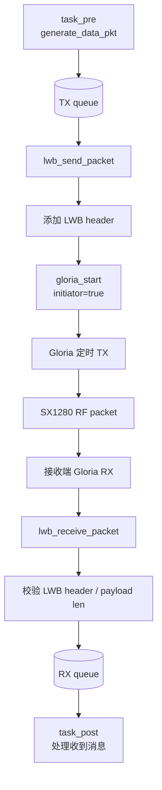

---

## 15. Host 与 Source 的区别

当前是否为 host 由:

```c
#define HOST_ID  1
#define NODE_ID  HOST_ID   // 默认
#define IS_HOST  (NODE_ID == host_id)
```

决定。

### Host 行为

```text
启动后:
  sync_state = SYNCED
  初始化 schedule

每个 round:
  发 SCHED1
  收 DATA
  处理 CONTENTION
  计算下一轮 schedule
  发 SCHED2
```

### Source 行为

```text
启动后:
  sync_state = BOOTSTRAP
  长时间接收,等待 host schedule

收到 schedule 后:
  更新网络时间
  按 schedule 睡眠/唤醒
  到自己的 data slot 才发送
  其他 slot 接收/转发
```

---

## 16. 如何切换调制方式

修改 [Inc/app_config.h](Inc/app_config.h):

```c
#define GLORIA_INTERFACE_MODULATION  11
```

常用值:

| 值 | 调制 | 状态 |
|---|---|---|
| `7` | LoRa SF5 | 已验证 |
| `8` | GFSK 125 kbit/s | 已验证 |
| `11` | FLRC 260 kbit/s CR=1/2 | 已验证,当前默认 |
| `9`, `10` | GFSK 200/250 kbit/s | 表项保留,不作为当前工作模式 |
| `12`, `13` | FLRC 650/1300 kbit/s | 表项就绪,未端到端验证 |

切换后需要重新编译并分别烧录 host/node。

---

## 17. 构建和烧录

构建:

```bash
make clean
make -j4
```

输出:

```text
build/comboard_lwb.elf
build/comboard_lwb.bin
```

当前构建 size:

```text
text=123400
data=4272
bss=30408
```

烧录示例:

```bash
st-flash --serial <BOARD_SN> --reset write build/comboard_lwb.bin 0x08000000
```

串口:

```bash
picocom --baud 115200 /dev/ttyACM1
```

典型成功日志:

```text
INFO radio: initialized
INFO task_com: modulation index 11: FLRC 260 kbit/s
INFO task_com: LWB successfully set period to 15s
INFO lwb: host node, network ID 0x4444
INFO lwb: pkt_len=32 slots=32 n_tx=2 ...
INFO lwb: DIO1: exec=... irq=... txd=... exti4=...
INFO task_post: 1 msg rcvd from network
```

---

## 18. 答辩时推荐的项目逻辑讲法

可以按下面顺序讲:

1. **硬件平台**
   - MCU 是 STM32L476RG
   - Radio 是 SX1280 / DLP-RFS1280
   - 当前是 NUCLEO + 模组 + PB4/PB11 飞线原型

2. **软件分层**
   - LWB 负责 round 和 slot schedule
   - Gloria 负责 slot 内同步泛洪
   - Radio 层负责 SX1280 LoRa/GFSK/FLRC 配置和收发

3. **运行过程**
   - Host 每 15 秒发一次 schedule
   - Source bootstrap 后按 schedule 醒来
   - 每个 schedule/data/contention 都通过 Gloria flood 传播
   - DIO1 时间戳用于同步和 flood marker 重建

4. **当前结果**
   - LoRa SF5、GFSK 125k、FLRC 260k 都已双板端到端跑通
   - 主要 SX1262→SX1280 driver bug 已修复
   - 下一步是把开发板飞线方案固化到自制 PCB

一句话版本:

> 这个项目的主线是:在 STM32L476RG 上运行 FreeRTOS 和 LWB,由 LWB 决定每 15 秒一个 round 中哪些节点在哪些 slot 发包;每个 slot 内调用 Gloria 做同步泛洪;Gloria 再通过 radio 抽象层控制 SX1280 以 LoRa/GFSK/FLRC 发收包。DIO1 同时进入 EXTI4 和 TIM2_CH4,分别解决唤醒和微秒级时间戳问题。
